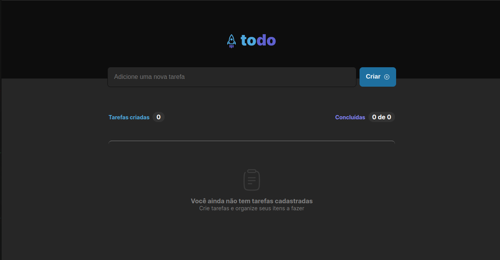
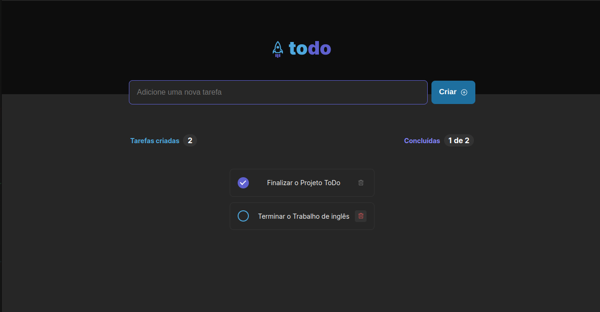

## Projeto 01 Trilha ReactJs 2022 Rocketseat. 
### Projeto gerenciador de tarefas.

#### Tecnologias usadas no projeto:

* ReactJs(Vite)
* TypeScript
* HTML5
* CSS3

#### Principais pacotes utilizados:

* uuid
* phosphor-react

#### Images do Projeto:

### Passo-a-passo para rodar a aplicação:

1. Entre na pasta ToDo-List;
2. use o comando: ***yarn*** ou ***npm install/i*** para instalar os pacotes;
3. use o comando: ***yarn dev*** ou ***npm run dev*** para rodar a aplicação.